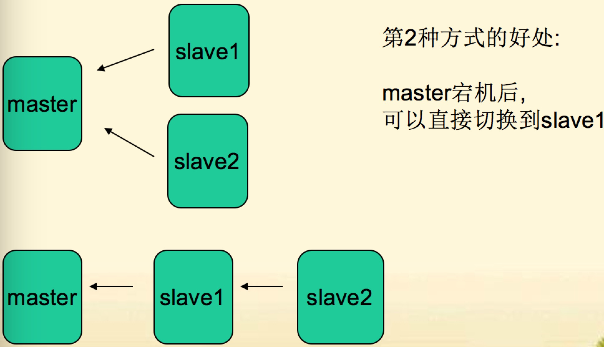
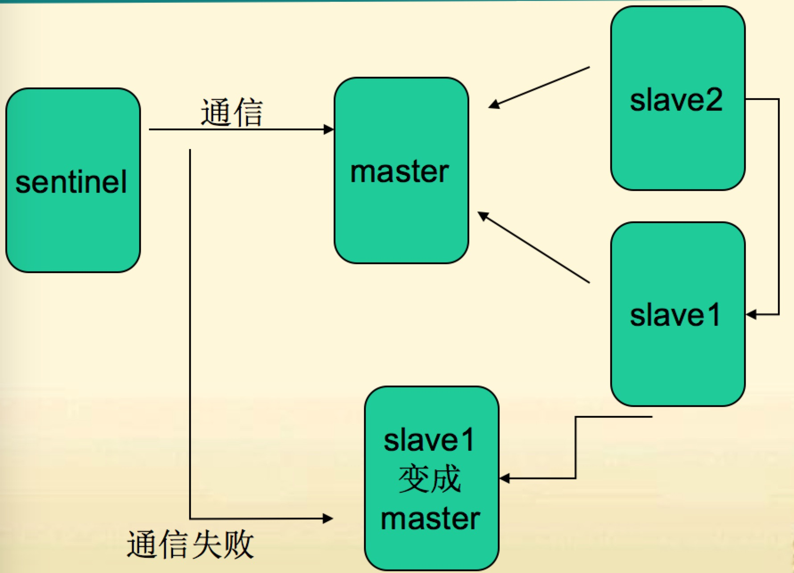

## redis

	
	REmote DIctionary Server    Redis
	
	是一个key-value存储系统。
	
	Redis是一个开源的使用ANSI C语言编写、遵守BSD协议、支持网络、
	
	可基于内存亦可持久化的日志型、Key-Value数据库，并提供多种语言的API。
	
	它通常被称为数据结构服务器，
	
	因为值（value）可以是 字符串(String), 哈希(Hash), 列表(list), 集合(sets) 和 有序集合(sorted sets)等5种类型
	
	

## redis memcached

- 对比

		
		redis是开源,BSD许可,高级的key-value存储系统.
		 
		可以用来存储字符串,哈希结构,链表,集合,因此,常用来提供数据结构服务
		
		redis和memcached相比,的独特之处:
		
		1: redis可以用来做存储(storge) memccached是用来做缓存(cache)
		  
		  这个特点主要因为其有”持久化”的功能 ---将内存数据写到硬盘上
		
		2: 存储的数据有”结构”   对于memcached来说,存储的数据,只有1种类型--”字符串”
		
		  而redis则可以存储字符串,链表,哈希结构,集合,有序集合.
		
		
		
	
	
## redis安装

- 步骤
	
		
		1. wget http://download.redis.io/releases/redis-4.0.10.tar.gz
		
		2. tar -zxvf redis-4.0.10.tar.gz
		
		3. cd redis-4.0.10/src
		
		4. make test
		
		5. yum install -y tcl
		
		6. make PREFIX=/usr/local/redis install
		
		7. cp /usr/local/src/redis-4.0.10/redis.conf  /usr/local/redis/redis.conf
		
		8. vim ./redis.conf
			
			daemonize yes
			

- 目录
	
		
		redis-benchmark          redis性能测试工具
		
		redis-check-aof          检查aof日志工具
		
		redis-check-dump         检查rbd日志工具
		
		redis-cli                redis命令行工具
		
		redis-server             redis服务进程
		
		
	
	
- 启动

	
					
		./bin/redis-server ./redis.conf
		
		port 6379
		
		连接 
		
			redis/bin/redis-cli
		
			退出
				
				SHUTDOWN
				
	

- key的命令
	
		
		keys *    
		// 返回所有key
		
		在redis里,允许模糊查询key  有3个通配符 *, ? ,[]
		
		*: 通配任意多个字符
		
		?: 通配单个字符
		
		[]: 通配括号内的某1个字符
		
		
		
		randomkey 
		// 返回随机key
		
		
		exists key
		// 判断key是否存在,返回1/0
		
		type key
		//返回key存储的值的类型
		// 有 string, link, set, order set, hash
		
		
		
		del key1 key2 ... Keyn
		// 作用: 删除1个或多个键
		// 返回值: 不存在的key忽略掉,返回真正删除的key的数量
		
		rename key newkey
		// 作用: 给key赋一个新的key名
		// 注:如果newkey已存在,则newkey的原值被覆盖
		
		renamenx key newkey  
		// 作用: 把key改名为newkey
		// 返回: 发生修改返回1,未发生修改返回0
		// 注: nx--> not exists, 即, newkey不存在时,作改名动作
		
		
		redis在redis.conf配置文件默认开启16个databases数据库
		
		默认是使用0号数据库
		
		select n; 选择n号数据库
		
		flushdb  // 清除当前数据库的数据
		
		move keyName n; // 将key移动n号服务器上
		
		ttl key 
		// 作用: 查询key的生命周期
		// 返回: 秒数
		
		注:对于不存在的key或已过期的key/不过期的key,都返回-1
		Redis2.8中,对于不存在的key,返回-2
		
		
		expire key 整型值
		// 作用: 设置key的生命周期,以秒为单位
		
		
		persist key
		// 作用: 把指定key置为永久有效
		
		
	
- string的命令
	
		
		set key value [ex 秒数] / [px 毫秒数]  [nx] /[xx]
		
		如: set a 1 ex 10 , 10秒有效
		Set a 1 px 9000  , 9秒有效
		
		注: 如果ex,px同时写,以后面的有效期为准
		如 set a 1 ex 100 px 9000, 实际有效期是9000毫秒
		
		nx: 表示key不存在时,执行操作
		xx: 表示key存在时,执行操作
		
		
		mset  multi set , 一次性设置多个键值
		例: mset key1 value1 key2 value2 ....
		
		get key 
		作用:获取key的值
		
		mget key1 key2 ..keyn
		作用:获取多个key的值
		
		
		setrange key offset value
		作用:把字符串的offset偏移字节,改成value  计数从0开始
		
		注意: 如果偏移量>字符长度, 该字符自动补\x00   
		
		redis 127.0.0.1:6379> set greet hello
		OK
		redis 127.0.0.1:6379> setrange greet 2 x
		(integer) 5
		redis 127.0.0.1:6379> get greet
		"hexlo"
		
		
		redis 127.0.0.1:6379> setrange greet 6 !
		(integer) 7
		redis 127.0.0.1:6379> get greet
		"heyyo\x00!"
		
		
		getrange key start stop
		作用: 是获取字符串中 [start, stop]范围的值 包含start和end
		
		注意: 对于字符串的下标,左数从0开始,右数从-1开始
		
			redis 127.0.0.1:6379> set title 'chinese'
			OK
			redis 127.0.0.1:6379> getrange title 0 3
			"chin"
			redis 127.0.0.1:6379> getrange title 1 -2
			"hines"
		
			注意: 
				1: start>=length, 则返回空字符串
				2: stop>=length,则截取至字符结尾
				3: 如果start 所处位置在stop右边, 返回空字符串
		
		
		append key value
		作用: 把value追加到key的原值上
		
		
		
		getset key newvalue
		作用: 获取并返回旧值,设置新值
			redis 127.0.0.1:6379> set cnt 0
			OK
			redis 127.0.0.1:6379> getset cnt 1
			"0"
			redis 127.0.0.1:6379> getset cnt 2
			"1"
		
		
		incr key
		作用: 指定的key的值加1,并返回加1后的值
		
		注意:
		1:不存在的key当成0,再incr操作
		2: 范围为64有符号
		
		
		incrby key number
		作用: 增加number
		
			redis 127.0.0.1:6379> incrby age  90 2
			(integer) 92
		
		incrbyfloat key floatnumber
		作用: 当成浮点数增加
		
			redis 127.0.0.1:6379> incrbyfloat age 3.5
			"95.5"
		
		decr key
		作用: 减少1
		
			redis 127.0.0.1:6379> set age 20
			OK
			redis 127.0.0.1:6379> decr age
			(integer) 19
			
		decrby key number
		作用: 减多少
		
		
			redis 127.0.0.1:6379> decrby age 3
			(integer) 16
		
		
		getbit key offset
		作用:获取值的二进制表示,对应位上的值(从左,从0编号)
		
			redis 127.0.0.1:6379> set char A
			OK
			redis 127.0.0.1:6379> getbit char 1
			(integer) 1
			redis 127.0.0.1:6379> getbit char 2
			(integer) 0
			redis 127.0.0.1:6379> getbit char 7
			(integer) 1
		
		
		setbit  key offset value
		设置offset对应二进制位上的值
		返回: 该位上的旧值
		
		注意: 
		1:如果offset过大,则会在中间填充0,
		2: offset最大大到多少
		3:offset最大2^32-1,可推出最大的的字符串为512M
		
		
		bitop operation destkey key1 [key2 ...]
		
		对key1,key2..keyN作operation,并将结果保存到 destkey 上。
		operation 可以是 AND 、 OR 、 NOT 、 XOR
		
			redis 127.0.0.1:6379> setbit lower 7 0
			(integer) 0
			redis 127.0.0.1:6379> setbit lower 2 1
			(integer) 0
			redis 127.0.0.1:6379> get lower
			" "
			redis 127.0.0.1:6379> set char Q
			OK
			redis 127.0.0.1:6379> get char
			"Q"
			redis 127.0.0.1:6379> bitop or char char lower
			(integer) 1
			redis 127.0.0.1:6379> get char
			"q"
			
		注意: 对于NOT操作, key不能多个
		
		

- link List 链表命令

		
		lpush key value 
		作用: 把值插入到链接头部  l--left 
		计数是从左往右从0开始  到最后是-1
		
		
		rpop key
		作用: 返回并删除链表尾元素
		
		rpush
		作用: 把值插入到链接头部  r--right
		
		lpop
		作用: 返回并删除链表头元素
		
		
		lrem key count value
		作用: 从key链表中删除 value值
		
		lrem arr 1 b
		从链表arr中从头部开始删除一个b
		
			注: 删除count的绝对值个value后结束
			
			Count>0 从表头删除
			
			Count<0 从表尾删除
		
		
		ltrim key start stop
		作用: 剪切key对应的链接,切[start,stop]一段,并把该段重新赋给key
		
		lindex key index
		作用: 返回index索引上的值,
			如  lindex key 2
		
		llen key
		作用:计算链接表的元素个数
		
			redis 127.0.0.1:6379> llen task
			(integer) 3
			redis 127.0.0.1:6379> 
		
		
		linsert  key after|before search value
		作用: 在key链表中寻找’search’,并在search值之前|之后,.插入value
			
			注: 一旦找到一个search后,命令就结束了,因此不会插入多个value
		
		
		rpoplpush source dest
		作用: 把source的尾部拿出,放在dest的头部 这是一个原子性的操作 保证了安全性
		并返回 该单元值
		
		场景: task + bak 双链表完成安全队列
		
		
		brpop ,blpop  key timeout
		作用:等待弹出key的尾/头元素, 
		Timeout为等待超时时间
		如果timeout为0,则一直等待
		
		场景: 长轮询Ajax,在线聊天时,能够用到
		
		
		
		

- set命令

		
		
		集合的性质: 唯一性,无序性,确定性
		
		注: 在string和link的命令中,可以通过range 来访问string中的某几个字符或某几个元素
		但,因为集合的无序性,无法通过下标或范围来访问部分元素.
		
		因此想看元素,要么随机先一个,要么全选
		
		
		sadd key  value1 value2
		作用: 往集合key中增加元素  添加成功返回1 失败0 
		
		唯一性就是体现在 一个值只能有一个
		
		srem value1 value2
		作用: 删除集合中集为 value1 value2的元素
			返回值: 忽略不存在的元素后,真正删除掉的元素的个数
		
		spop key
		作用: 返回并删除集合中key中1个随机元素
		
		随机--体现了无序性
		
		srandmember key
		作用: 返回集合key中,随机的1个元素.
		
		sismember key  value
		作用: 判断value是否在key集合中
		是返回1,否返回0
		
		smembers key
		作用: 返回集中中所有的元素
		
		scard key
		作用: 返回集合中元素的个数
		
		smove source dest value
		作用:把source中的value删除,并添加到dest集合中
		
		
		
		sinter  key1 key2 key3
		作用: 求出key1 key2 key3 三个集合中的交集,并返回
		
			redis 127.0.0.1:6379> sadd s1 0 2 4 6
			(integer) 4
			redis 127.0.0.1:6379> sadd s2 1 2 3 4
			(integer) 4
			redis 127.0.0.1:6379> sadd s3 4 8 9 12
			(integer) 4
			redis 127.0.0.1:6379> sinter s1 s2 s3
			1) "4"
			redis 127.0.0.1:6379> sinter s3 s1 s2
			"4"
		
		sinterstore dest key1 key2 key3
		作用: 求出key1 key2 key3 三个集合中的交集,并赋给dest
		
		
		suion key1 key2.. Keyn
		作用: 求出key1 key2 keyn的并集,并返回
		
		sdiff key1 key2 key3 
		作用: 求出key1与key2 key3的差集
			即 key1 - key2 - key3 
		
		
	
	
- order set 有序集合命令

		
		zadd key score1 value1 score2 value2 ..
		添加元素  // score是排序的依据
		
			redis 127.0.0.1:6379> zadd stu 18 lily 19 hmm 20 lilei 21 lilei
			(integer) 3
		
		zrem key value1 value2 ..
		作用: 删除集合中的元素
			
		zremrangebyscore key min max
		作用: 按照socre来删除元素,删除score在[min,max]之间的
		
			redis 127.0.0.1:6379> zremrangebyscore stu 4 10
			(integer) 2
			redis 127.0.0.1:6379> zrange stu 0 -1
			1) "f"
		
		zremrangebyrank key start end
		作用: 按排名删除元素,删除名次在[start,end]之间的
		
			redis 127.0.0.1:6379> zremrangebyrank stu 0 1
			(integer) 2
			redis 127.0.0.1:6379> zrange stu 0 -1
			1) "c"
			2) "e"
			3) "f"
			4) "g"
		
		zrank key member
		查询member的排名(升续 0名开始)
		
		zrevrank key memeber
		查询 member的排名(降续 0名开始)
		
		zrange key start stop [WITHSCORES]
		把集合排序后,返回名次[start,stop]的元素
		默认是升续排列 
		Withscores 是把score也打印出来
		
		zrevrange key start stop
		作用:把集合降序排列,取名字[start,stop]之间的元素
		
		zrangebyscore  key min max [withscores] limit offset N
		作用: 集合(升续)排序后,取score在[min,max]内的元素,
		并跳过 offset个, 取出N个
		
		
		
		zcard key
		返回元素个数
		
		zcount key min max
		返回[min,max] 区间内元素的数量
		
		
		zinterstore destination numkeys key1 [key2 ...] 
		[WEIGHTS weight [weight ...]] 
		[AGGREGATE SUM|MIN|MAX]
		求key1,key2的交集,key1,key2的权重分别是 weight1,weight2
		聚合方法用: sum |min|max
		聚合的结果,保存在dest集合内
		
		注意: weights ,aggregate如何理解?
		答: 如果有交集, 交集元素又有socre,score怎么处理?
		 Aggregate sum->score相加   , min 求最小score, max 最大score
		 
		另: 可以通过weigth设置不同key的权重, 交集时,socre * weights
		
		
		
	
	
- Hash 哈希的命令

		
		hset key field value
		作用: 把key中 filed域的值设为value
		注:如果没有field域,直接添加,如果有,则覆盖原field域的值
		
		hmset key field1 value1 [field2 value2 field3 value3 ......fieldn valuen]
		作用: 设置field1->N 个域, 对应的值是value1->N
		
		(对应PHP理解为  $key = array(file1=>value1, field2=>value2 ....fieldN=>valueN))
		
		
		hget key field
		作用: 返回key中field域的值
		
		hmget key field1 field2 fieldN
		作用: 返回key中field1 field2 fieldN域的值
		
		hgetall key
		作用:返回key中,所有域与其值
		
		hdel key field
		作用: 删除key中 field域
		
		hlen key
		作用: 返回key中元素的数量
		
		hexists key field
		作用: 判断key中有没有field域
		
		hinrby key field value
		作用: 是把key中的field域的值增长整型值value
		
		hinrby float  key field value
		作用: 是把key中的field域的值增长浮点值value
		
		hkeys key
		作用: 返回key中所有的field
		
		kvals key
		作用: 返回key中所有的value
		
		

#### Redis 中的事务

- Redis支持简单的事务

- Redis与 mysql事务的对比

		
		 项目                         Mysql                         Redis         
		 
		 开启                         start transaction             muitl
		 
		 语句                         普通sql(建表语句会中止当前事务)   普通命令
		 
		 失败                         rollback 回滚                  discard 取消
		 
		 成功                         commit                         exec
		 
		 
		 注: rollback与discard 的区别
		 如果已经成功执行了2条语句, 第3条语句出错.
		 Rollback后,前2条的语句影响消失.
		 Discard只是结束本次事务,前2条语句造成的影响仍然还在
		 
		 在开启multi后 执行的命令都会放到队列里 当执行exec命令后统一执行
		 
		 注:
		 在mutil后面的语句中, 语句出错可能有2种情况
		 1: 语法就有问题, 
		 这种,exec时,报错, 所有语句得不到执行
		 
		 2: 语法本身没错,但适用对象有问题. 比如 zadd 操作list对象
		 Exec之后,会执行正确的语句,并跳过有不适当的语句.
		 
		 (如果zadd操作list这种事怎么避免? 这一点,由程序员负责)
		 
		 
		 
		事务中有  ---  watch命令 来监控某个值得变化 如果值发生变化就取消事务
		
		watch key1 key2  ... keyN
		作用:监听key1 key2..keyN有没有变化,如果有变, 则事务取消
		
		unwatch 
		作用: 取消所有watch监听
		
		
		
		 例: 
		 redis 127.0.0.1:6379> watch ticket
		 OK
		 redis 127.0.0.1:6379> multi
		 OK
		 redis 127.0.0.1:6379> decr ticket
		 QUEUED
		 redis 127.0.0.1:6379> decrby money 100
		 QUEUED
		 redis 127.0.0.1:6379> exec
		 (nil)   // 返回nil,说明监视的ticket已经改变了,事务就取消了.
		 redis 127.0.0.1:6379> get ticket
		 "0"
		 redis 127.0.0.1:6379> get money
		 "200"
		 
		 
		                        
	
	
- 消息订阅

		
		使用办法:
		
			订阅端: subscribe 频道名称
			
			发布端: publish 频道名称 发布内容
			
			psubscribe new*   订阅以new为开头的频道
			
			unsubscribe  解除订阅
			
			psubscribe   pattern 解除订阅
			
			pubsub 管理当前的订阅频道
		
		客户端例子:
		redis 127.0.0.1:6379> subscribe news
		Reading messages... (press Ctrl-C to quit)
		1) "subscribe"
		2) "news"
		3) (integer) 1
		1) "message"
		2) "news"
		3) "good good study"
		1) "message"
		2) "news"
		3) "day day up"
		
		服务端例子:
		redis 127.0.0.1:6379> publish news 'good good study'
		(integer) 1
		redis 127.0.0.1:6379> publish news 'day day up'
		(integer) 1
		
		
		
	
## Redis持久化

		
		持久化: 即把数据存储于断电后不会丢失的设备中 通常是硬盘
		
		常见的持久化方式: 
			
			主从: 通过从服务器保存和持久化 如mongodb的replication sets配置
			
			日志: 操作生成相关日志 并通过日志来恢复数据
			
				counchDB对于数据内容 不修改 只追加 则文件本身就是日志 不会丢失数据
				
		
	
	

1. redis - rdb快照持久化

		
		工作原理:
			
			每隔N分钟 或 N写操作后
			
			从内存dump数据形成rdb文件
			
			压缩
			
			放在 备份目录
		
		在redis.conf进行配置
		
			save 选项 进行配置
			
			save 秒数 数据修改次数
			
				save 900 1     # 刷新快照到硬盘中，必须满足两者要求才会触发 即900秒之后至少1个关键字发生变化
				save 300 10    # 必须是300秒之后至少10个关键字发生变化。
				save 60 10000  # 必须是60秒之后至少10000个关键字发生变化
			
			(这3个选项都屏蔽,则rdb禁用)
			
				
		redis-server
			
			老版本是这个进程不仅负责监听客户端的请求 同时还要负责导出RDB
			
			新版本是redis-server进程生成一个子进程(称为:rdbdump进程) 专门负责导出RDB 如果这个子进程导出RDB出错了 例如硬盘空间慢等原因
			
			这时候redis最好停止写入数据 不然导致 数据不一致 问题就严重了
			
			所以设置 
			
			stop-writes-on-bgsave-error yes    # 后台存储错误停止写
		
		
		rdbcompression yes     # 使用LZF压缩rdb文件
		
		rdbchecksum yes        # 存储和加载rdb文件时校验
		
		dbfilename dump.rdb    # 设置rdb文件名
		
		dir ./                 #  设置工作目录，rdb文件会写入该目录
		
		
		rdb的缺陷:
			
			在2个保存点之间,断电,
			
			将会丢失1-N分钟的数据
			
			出于对持久化的更精细要求,redis增添了aof方式 append only file
			
		优势: 因为是一整个二进制数据块 所以导入速度快
		
		
	
2. redis - aof日志持久化

		
		redis2.4以后添加aof日志
		
		可以和rdb同时使用
		
		
		aof工作原理:
			
			Server主进程 收到 客户端发送命令后 同时发送给 aof子进程
			
			aof子进程收到后 记录下来
			
			而aof子进程写记录通过配置来确定
			
		aof重写:
			
			在某一时刻点 把内存中的keyvalue逆化成相关的命令
			
			把命令写到aof日志
		
		aof配置:
		
		appendonly no                     # 是否打开 aof日志功能
		
		appendfsync always                # 每1个命令,都立即同步到aof. 安全,速度慢
		
		appendfsync everysec              # 折衷方案,每秒写1次
		
		appendfsync no                    # 写入工作交给操作系统,由操作系统判断缓冲区大小,统一写入到aof. 同步频率低,速度快,
		
		no-appendfsync-on-rewrite  yes:   # 正在导出rdb快照的过程中,要不要停止同步aof
		
		auto-aof-rewrite-percentage 100   # 重写条件:  aof文件大小比起上次重写时的大小,增长率100%时
		
		auto-aof-rewrite-min-size 64mb    # 重写条件:  aof文件,至少超过64M时,重写
		
		
		注: 在dump rdb过程中,aof如果停止同步,会不会丢失?
		答: 不会,所有的操作缓存在内存的队列里, dump完成后,统一操作.
		
		注: aof重写是指什么?
		答: aof重写是指把内存中的数据,逆化成命令,写入到.aof日志里.
		以解决 aof日志过大的问题.
		
		问: 如果rdb文件,和aof文件都存在,优先用谁来恢复数据?
		答: aof
		
		问: 2种是否可以同时用?
		答: 可以,而且推荐这么做
		
		问: 恢复时rdb和aof哪个恢复的快
		答: rdb快,因为其是数据的内存映射,直接载入到内存,而aof是命令,需要逐条执行
		
		
	
	
## redis集群

- 集群作用:

			
		1:  主从备份 防止主机宕机
			
		2:  读写分离,分担master的任务
			
		3:  任务分离,如从服分别分担备份工作与计算工作
		
	

- 主从通信原理
	
		
		1. slave第一次 向 master 发送 同步请求
		
		2. master dump 出 rdb 给 slave
		
		3. 在dump rdb给slave时候 master的aof子进程同时在缓存运行的命令
		
		4. dump rdb给slave 结束后  在把 aof 同步给slave
		
		5. 完成上述以后 就通过 replicationFeedSlaves子进程进行同步了
		
		
	
	

- 集群配置

		
		Master配置:
		
			1: 关闭rdb快照(备份工作交给slave)
			
			2: 可以开启aof
		
		slave配置:
		
			1: 声明slaveof
			
			2: 配置密码[如果master有密码]
			
			3: [某1个]slave打开 rdb快照功能
			
			4: 配置是否只读[slave-read-only]
			
		Master需要配置项目:
		
			#save            # 关闭rdb
			
			appendonly no    # aof 视情况关闭或开启
			
			requirepass      # 设置密码
			
			
		slave需要配置项目:
		
			daemonize   yes                          // 以后台形式运行
		
			pidfile   path/redis6380.pid            // pid文件
		
			port   6380                            // 端口
		
			dbfilename   dump6380.rdb             //  从服务器承担rdb工作 就减轻主服务器压力
			
			slave-of 主服务器地址   主服务端口        // 开启slave 就是确认主服务器的地址 和 端口
			
			slave-read-only    yes                // 开启slave 只读功能
			 
			masterauth      requirepass-value     // 设置主服务器密码
		
		
		
		
	
	
- redis主从复制的缺陷

		
		缺陷:
		
			每次salave断开后,(无论是主动断开,还是网络故障)
			
			再连接master
		
			都要master全部dump出来rdb,再aof,即同步的过程都要重新执行1遍
		
		
		
			所以要记住---多台slave不要一下都启动起来,否则master可能IO剧增
			
	
	
- redis运维常用命令

		
		time                         查看时间戳与微秒数
		 
		dbsize                       查看当前库中的key数量
		
		bgrewriteaof                 后台进程重写AOF
		
		bgsave                       后台保存rdb快照   // 另起一个进程 进行保存数据
		
		save                         保存rdb快照      // 使用当前主进程 进行保存数据  阻塞主进程工作
		
		lastsave                     上次保存时间
		
		slaveof                      设为slave服务器
		
		flushall                     清空所有db
		
		fluashdb                     清空当前db
		
		shutdown[""|save|nosave]     断开连接,关闭服务器  
		
		slowlog                      显示慢查询
		
		info                         显示服务器信息
		
		config get                   获取配置信息
		
		config set                   设置配置信息
		
		monitor                      打开控制台
		
		sync                         主从同步
		
		client list                  客户端列表
		
		client kill                  关闭某个客户端
		
		client setname               为客户端设置名字
		
		client getname               获取客户端名字
		
		
		
		
		
		redis 服务器端命令
		redis 127.0.0.1:6380> time  ,显示服务器时间 , 时间戳(秒), 微秒数
		1) "1375270361"
		2) "504511"
		
		redis 127.0.0.1:6380> dbsize  // 当前数据库的key的数量
		(integer) 2
		redis 127.0.0.1:6380> select 2
		OK
		redis 127.0.0.1:6380[2]> dbsize
		(integer) 0
		redis 127.0.0.1:6380[2]> 
		
		
		BGREWRITEAOF 后台进程重写AOF
		BGSAVE       后台保存rdb快照
		SAVE         保存rdb快照
		LASTSAVE     上次保存时间
		
		Slaveof master-Host port  , 把当前实例设为master的slave
		
		Flushall  清空所有库所有键 
		Flushdb  清空当前库所有键
		Showdown [save/nosave]
		
		注: 如果不小心运行了flushall, 立即 shutdown nosave ,关闭服务器
		然后 手工编辑aof文件, 去掉文件中的 “flushall ”相关行, 然后开启服务器,就可以导入回原来数据.
		
		如果,flushall之后,系统恰好bgrewriteaof了,那么aof就清空了,数据丢失.
		
		Slowlog 显示慢查询
		注:多慢才叫慢? 
		
		Redis 的慢查询日志功能用于记录执行时间超过给定时长的命令请求， 用户可以通过这个功能产生的日志来监视和优化查询速度
		
		答: 由slowlog-log-slower-than 10000 ,来指定,(单位是微秒)
		
		服务器储存多少条慢查询的记录?
		答: 由 slowlog-max-len 128 ,来做限制
		
		Info [Replication/CPU/Memory..] 
		查看redis服务器的信息
		
		Config get 配置项  
		Config set 配置项 值 (特殊的选项,不允许用此命令设置,如slave-of, 需要用单独的slaveof命令来设置)
		
		
		Redis运维时需要注意的参数---运维时的观察参数
		
		1: 内存
		# Memory
		used_memory:859192 数据结构的空间
		used_memory_rss:7634944 实占空间
		mem_fragmentation_ratio:8.89 前2者的比例,1.N为佳,如果此值过大,说明redis的内存的碎片化严重,可以导出再导入一次.
		
		2: 主从复制
		# Replication
		role:slave
		master_host:192.168.1.128
		master_port:6379
		master_link_status:up
		
		3:持久化
		# Persistence
		rdb_changes_since_last_save:0
		rdb_last_save_time:1375224063
		
		4: fork耗时
		#Status
		latest_fork_usec:936  上次导出rdb快照,持久化花费微秒
		注意: 如果某实例有10G内容,导出需要2分钟,
		每分钟写入10000次,导致不断的rdb导出,磁盘始处于高IO状态.
		
		5: 慢日志
		config get/set slowlog-log-slower-than
		CONFIG get/SET slowlog-max-len 
		slowlog get N 获取慢日志
		
		
	
	
- redis 运维工作

		
		shutdown nosave                // 关闭的时候 不保存该命令
		
		在redis进程运行时候 rdb文件处于打开状态
		
		复制的rdb文件 占据同样的句柄
		
		所以要在复制之前 彻底关闭所有redis进程 pkill -g redis
		
		取消了redis对rdb文件的占用
		
		这样就可以了
		
			
				
	
- sentine redis监控工具

  

- redis 修改slave为master

		
		运行时更改master-slave
			修改一台slave(设为A)为new master 
			命令该服务不做其他redis服务的slave 
			
		   	命令:
				 
				 slaveof no one  # 不做任何的slave
			
				 slave-read-only  no  # yes代表只读 no为可写
		
		其他的slave再指向new master A
		
			命令该服务为new master A的slave
			
			命令格式 slaveof IP port
		
		
		

- sentine 配置
	
		
		Sentinel不断与master通信,获取master的slave信息.
		监听master与slave的状态
		如果某slave失效,直接通知master去除该slave.
		
		如果master失效,是按照slave优先级(可配置), 选取1个slave做 new master
		,把其他slave--> new master
		
		疑问: sentinel与master通信,如果某次因为master IO操作频繁,导致超时,
		此时,认为master失效,很武断.
		解决: sentnel允许多个实例看守1个master, 当N台(N可设置)sentinel都认为master失效,才正式失效.
		
		Sentinel选项配置
		port 26379 # 端口
		sentinel monitor mymaster 127.0.0.1 6379 2 ,
		给主机起的名字(不重即可), 
		当2个sentinel实例都认为master失效时,正式失效
		
		sentinel down-after-milliseconds mymaster 30000  多少毫秒后连接不到master认为断开
		
		sentinel can-failover mymaster yes #是否允许sentinel修改slave->master. 如为no,则只能监控,无权修改.
		
		sentinel parallel-syncs mymaster 1 , 一次性修改几个slave指向新的new master.
		
		sentinel client-reconfig-script mymaster /var/redis/reconfig.sh ,# 在重新配置new master,new slave过程,可以触发的脚本
		
		sentine监控配置:
		
			sentinel monitor def_master 127.0.0.1 6379 2  
		
			sentinel auth-pass def_master 012_345^678-90  
		
			##master被当前sentinel实例认定为“失效”的间隔时间  
			
			##如果当前sentinel与master直接的通讯中，在指定时间内没有响应或者响应错误代码，那么  
			
			##当前sentinel就认为master失效(SDOWN，“主观”失效)  
			
			##<mastername> <millseconds>  
				
			##默认为30秒  
			
			sentinel down-after-milliseconds def_master 30000  
		
			##当前sentinel实例是否允许实施“failover”(故障转移) 
			 
			##no表示当前sentinel为“观察者”(只参与"投票".不参与实施failover)
			
			##全局中至少有一个为yes 
			 
			sentinel can-failover def_master yes  
		
			##sentinel notification-script mymaster /var/redis/notify.sh  
		
		
		
	
	
#### key设计原则

	1: 把表名转换为key前缀 如, tag:
	
	2: 第2段放置用于区分区key的字段--对应mysql中的主键的列名,如userid
	
	3: 第3段放置主键值,如2,3,4...., a , b ,c
	
	4: 第4段,写要存储的列名
	
	
	用户表 user 转换为key-value存储
	
	下面是表结构:
	
		userid          username       passworde           email
		
		9               Lisi           1111111             lisi@163.com
	
	set  user:userid:9:username lisi
	set  user:userid:9:password 111111
	set  user:userid:9:email   lisi@163.com
	
	keys user:userid:9*
	
	
	2 注意:
	
		在关系型数据中,除主键外,还有可能其他列也步骤查询,
		
		如上表中, username 也是极频繁查询的,往往这种列也是加了索引的.
	
		转换到k-v数据中,则也要相应的生成一条按照该列为主的key-value
		
		Set  user:username:lisi:uid  9  
	
		这样,我们可以根据username:lisi:uid ,查出userid=9, 
		
		再查user:9:password/email ...
	
		完成了根据用户名来查询用户信息
		

- php-redis扩展编译

		
		1: 到pecl.php.net  搜索redis
		
		2: 下载stable版(稳定版)扩展
		
		3: 解压
		
		4: 执行/php/path/bin/phpize (作用是检测PHP的内核版本,并为扩展生成相应的编译配置)
		
		5: configure --with-php-config=/php/path/bin/php-config
		
		6: make && make install
		
		
		引入编译出的redis.so插件
		
			1: 编辑php.ini
			
			2: 添加 extension = /path/redis.so
			
			3: 重启php
		
		redis插件的使用
		
		// get instance
		
			$redis = new Redis();
		
		// connect to redis server
		
			$redis->open('localhost',6380);
		
			$redis->set('user:userid:9:username','wangwu');
		
			var_dump($redis->get('user:userid:9:username'));
		
		
		
		
		
		
		
		
		
		
	